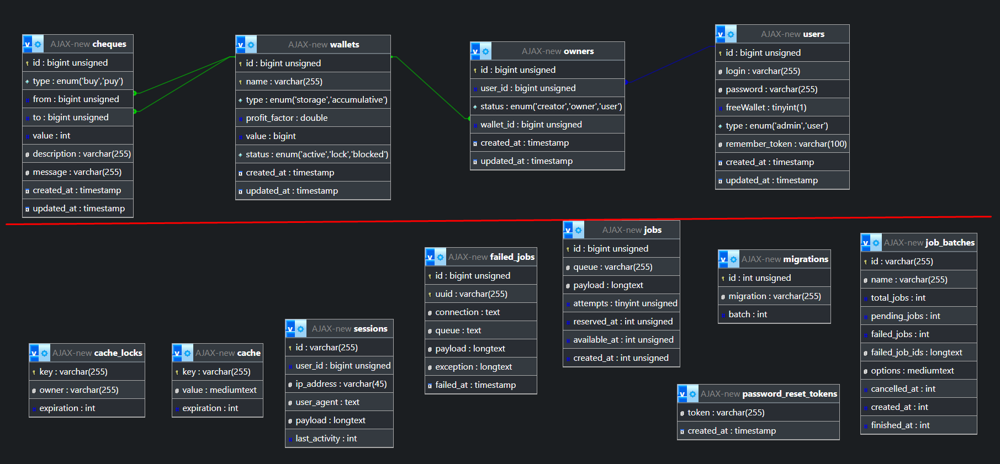
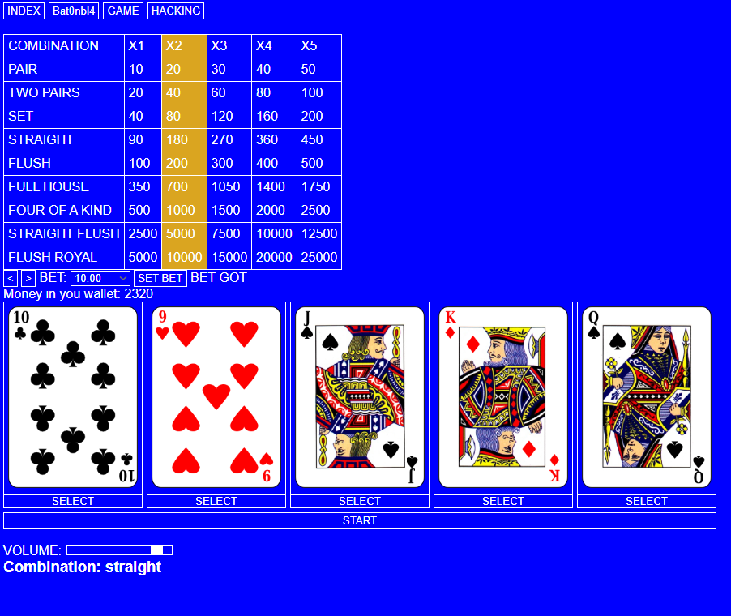
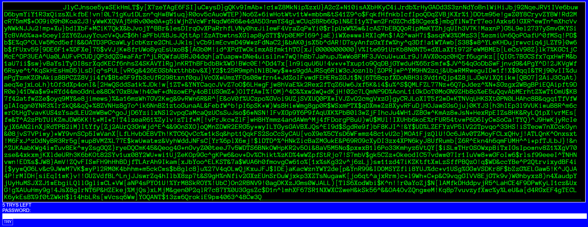

# Проект "Казино" или "Поккер для одного"

    Этот проект я делал чисто для себя, когда уже больше понимал о проектировании баз данных. Но в первую очередь с его помощью я изучал Ajax. Версия Laravel тут 11, на тот момент она совсем недавно вышла. Тут я не запаривался над дизайном. Это для меня было не главное.

<h2>Задачи, которые я перед собой ставил:</h2>
<ul>
    <li>
        Пользователь должен иметь возможность авторизации и регистрации.
    </li>
    <li>
        Пользователь имеет возможность создавать кошельки за игровую валюту. Первый кошелёк создаётся бесплатно.
    </li>
    <li>
        Есть 2 типа кошелька. Обычный, который можно выбрать для игры. Накопительный, на него можно перевести валюту, после чего заблокировать и на нём будет копиться дополнительная валюта)
    </li>
    <li>
        Пользователь имеет возможность добавлять пользователей, которые могут пользоваться кошельком.
    </li>
    <li>
        <b>Самое главное</b>: во время игры карты, которые должны отображаться пользователю, будут появляется на стрнице без её полной перезагрузки. (То самое применение Ajax)
    </li>
</ul>

    На кратинке, то что под красной чертой, это схемы системные. Сверху те что я ручками своими делал)

    Сама игра:

    Из вот прям итерестного тут по сути только <a href="https://github.com/Bat0nbl4/Scripts/blob/main/PHP/Laravel/Casino/resources/js/game.js">вот этот js код</a> и <a href="https://github.com/Bat0nbl4/Scripts/blob/main/PHP/Laravel/Casino/Controllers/Game/GameActionController.php">GameActionController.php</a> в нём функции описывают игровой процесс.

    С контролерами я тут работал так же как и в проекте с книгами. То есть разделял работу с моделью на 2 контролера. Первый для возврата стриниц, второй для прочего.

<h2>HACK</h2>

    Всё то что связанно с hack, это я делал ещё одну игру, внутри этого же проекта. Её суть такова что пользователь видит большой набор символов. Среди них нужно найти пароль. Типа он что то хакает :) Пароль может существовать только внутри одикаовых скобок. Например (982qfbsfda) - это может быть паролем. Если пользователь его введёт - он победил. А вот [dasf244bsdbzbd} - это фальшивка. Потму что скобки разные. Вообщем такая логика.

    Весь текст и правильный пароль сохраняются в сессии пользователя с помощью методов, предоставляемые Laravel. 

Вот как это выглядит:

