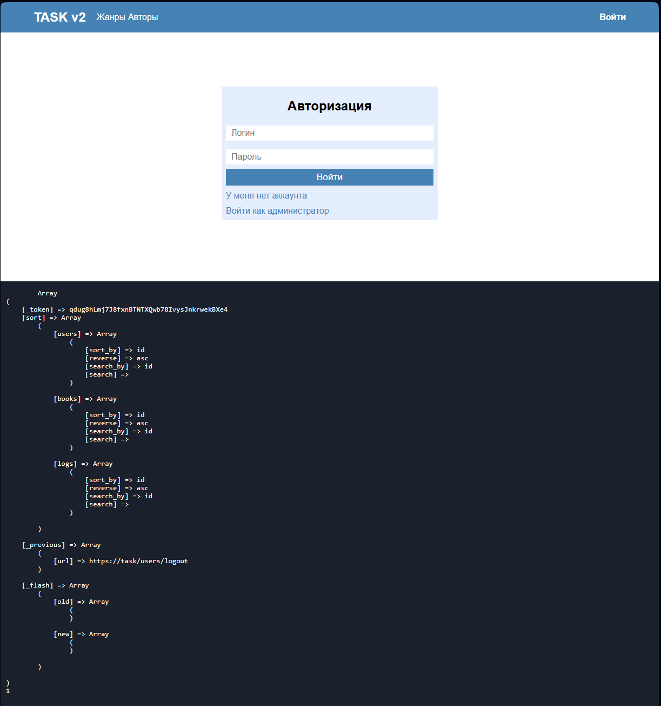

# Проект "Реестр книг"

    Проект "Реестр книг" на фреймворке Laravel. Версия лавы 10. Это вообще мой первый сайт на php. Можно сказать что я одновременно изучал и php и Laravel. Тогда я думал что у меня хорошо получилось, а сейчас посмотрел код, аж стыдно его кидать)

Задачи для проекта (то что помню):

<ul>
    <li>
        Пользователь должен иметь возможность авторизации и регистрации. Причём есть 3 типа пользователей. Первый: обычный пользователь. Второй: издатель. Третий: администратор. У издателя есть возможность публиковать книги.
    </li>
    <li>
        Администратор имеет возможность редактировать/удалять книги, и акаунты пользователей. (Тут я почему то сделал для администратора одельную авторизацию. Хотя можно было сделать авторизацию админа, при авторизации пользователя. Всё равно работа с одними и теми же данными. Т.е. нет одтельной таблицы с админами или что то такое. Не помню уже зачем.)
    </li>
    <li>
        Во время публикации книги должна быть возможность указать: название, автора, жанр, тип издания (Печатное, Графическое, Электронное) и описание. А так же возможность установить обложку этой книги. (картинка)
    </li>
</ul>

Там конечно было болше пунктов и описаны они были подробнее, но это то что я помню.

