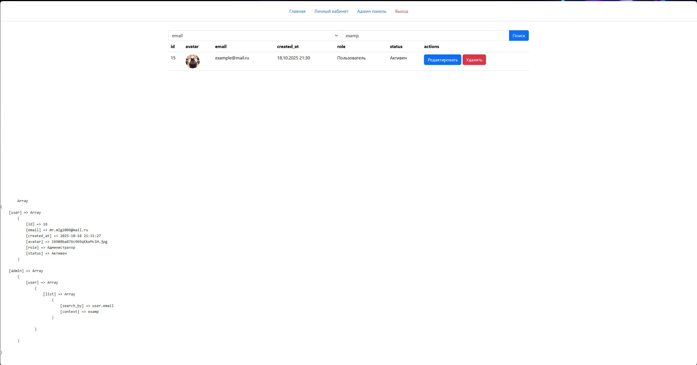

# OBWP

    У нас есть курс - <a href="https://portal.edu.asu.ru/course/view.php?id=9806">Обеспечение безопасности веб-приложений</a>, по результату прохождения которого, мы должны спроектироват и написать сайт на php.

    Для выполнения этой работы я использовал свой <a href="https://github.com/Bat0nbl4/Scripts/tree/main/PHP/NoFrameWork/library">Старый фремворк</a>, но значительно улучшенный. Всё самое "вкусное" находится в папке <a href="https://github.com/Bat0nbl4/Scripts/tree/main/PHP/NoFrameWork/OBWP/public/vendor">vendor</a>.

    Система View представлений находятся в папке <a href="https://github.com/Bat0nbl4/Scripts/tree/main/PHP/NoFrameWork/OBWP/public/resources/render">render</a>.
    <ul>
        <li><b>components</b> - Компонеты, которые можно включать в любом месте view представления.</li>
        <li><b>templates</b> - Шаблоны. По умолчанию используется шаблон с названием "app.php".</li>
        <li><b>views</b> - Страницы.</li>
    </ul>

    <a href="https://github.com/Bat0nbl4/Scripts/blob/main/PHP/NoFrameWork/OBWP/public/routes/routes.php">Маршруты</a>.

    Каждый маршрут обрабатывает свой метод <a href="https://github.com/Bat0nbl4/Scripts/tree/main/PHP/NoFrameWork/OBWP/public/controllers">контролера</a>. Класс "<a href="https://github.com/Bat0nbl4/Scripts/blob/main/PHP/NoFrameWork/OBWP/public/controllers/Controller.php">Controller</a>" явлеяется базовым.

## Скриншоты страниц:

