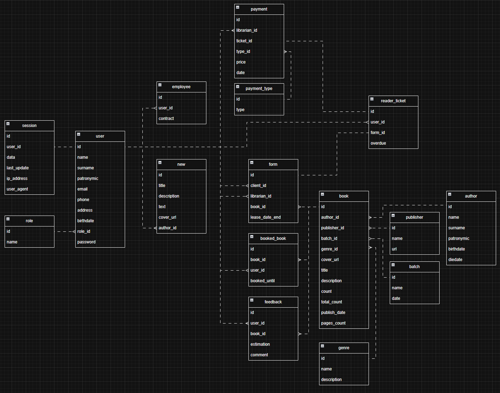

# Проект "Библиотека"

    У нас есть курс - <a href="https://portal.edu.asu.ru/course/view.php?id=9802">Разработка кода информационных систем</a>, по результату прохождения которого, мы должны спроектироват и написать сайт на php. У каждого своя тема сайта. У меня библиотека. И для этого я решил подготовить что то типа маленького фреймворка. За одно хотел разобраться, как это происходит за кулисами удобных функций и готовых методов.

    По итогу я имею очередной недописанный проект) Закос под Laravel. Не думаю что этот код имеет для вас вес. Самое итерестное что тут есть находится в папке <a href="https://github.com/Bat0nbl4/Scripts/blob/main/PHP/NoFrameWork/library/public/vendor/">vendor</a>. Всё что есть в этом проекте я писал сам. Тут я больше хочу показать схему бд:

